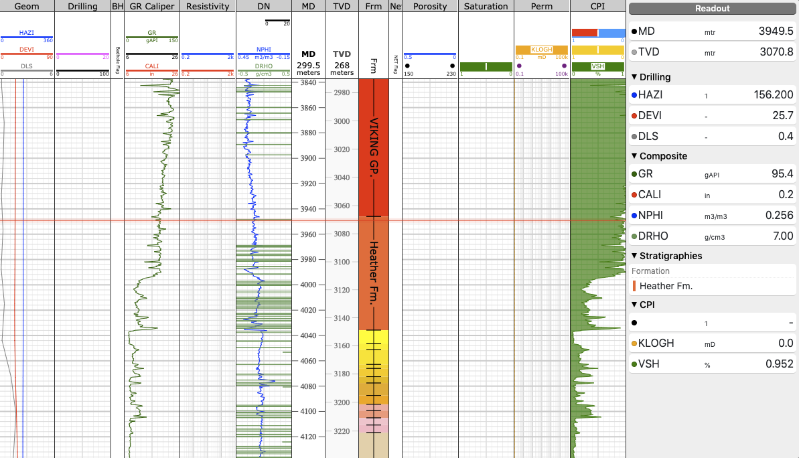

# Videx Well Log

_Well log powered by the ViDEx well log components and [Volve open data sets](https://data.equinor.com/) provided by Equinor._

```
npm install @equinor/videx-wellog
```

## Docs
Generate type-doc to `./docs`
```
npm run docs 
```

## Storybook

```
# from root:
cd examples/storybook
npm run storybook
```

## Contribute:
How to Contribute is described [here](./contributing.md)
