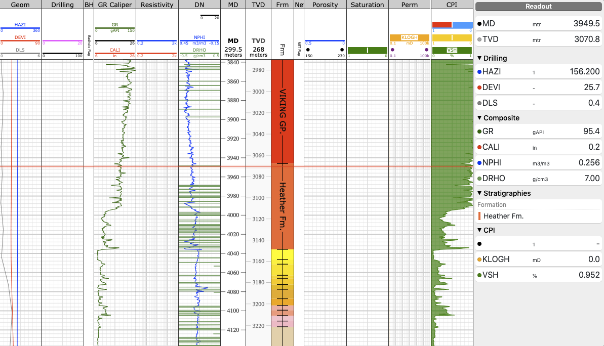

[](https://scm-compliance-api.radix.equinor.com/repos/equinor/videx-wellog/badge)

# Videx well log
Videx Well Log is a TypeScript library for rendering interactive well log visualizations.

It provides composable UI containers, tracks, plots and scale handlers that can be combined to build domain-specific well log views.



## Installation
```
npm install @equinor/videx-wellog
```

## Development
Install dependencies:
```
npm install
```

Build library output:
```
npm run build
```

Run tests:
```
npm test
```

Run linting:
```
npm run lint
```

Run with file watching:
```
npm run start
```

Generate type-doc to `./docs`:
```
npm run docs
```

## Storybook

```
# from root:
npm run storybook:install
npm run storybook
```

## Tracks

Tracks are components added to a well log container. A track is responsible for reacting to lifecycle events provided by its container.

## Distribution Track

`DistributionTrack` visualizes data composition (continuous or discrete) along depth, with optional interpolation modes.

### Config
Sample configuration object:

```js
{
  label: 'Distribution',
  abbr: 'Dst',
  data: [
    {
        "depth": 1,
        "composition": [
            { "key": "carbonate", "value": 80.00 },
            { "key": "shale", "value": 20.00 }
        ]
    },
    {
        "depth": 2,
        "composition": [
            { "key": "carbonate", "value": 40.00 },
            { "key": "shale", "value": 60.00 }
        ]
    }
  ],
  legendConfig: distributionLegendConfig,
  components: {
    carbonate: {
      color: 'FireBrick',
      textColor: '#8E1B1B', // Optional, will use color by default
    },
    shale: {
      color: 'SlateGrey',
    },
  },
  interpolationType: 2, // 0 = linear, 1 = nearest, 2 = discrete
  discreteHeight: 0.01, // Used when interpolationType = 2
}
```

Important:

- Keys in `composition[].key` should match keys in `components`.
- `distributionLegendConfig` uses colors defined in `components`.
- Composition values are interpreted as percentages and should sum to 100.

### Assumptions
- Depth is sorted in ascending order.
- Composition totals 100 for each depth sample.

## Contribution
Contributions are welcome. See the [contribution guide](./contributing.md) to get started.
