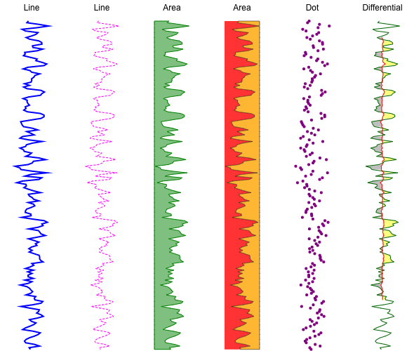

# Plots
Plots are containers for rendering a single data serie. Its a simple abstraction for layering multiple graphs within a single GraphTrack.

## Plot
Base class for all plot types. All plots requires an id and a scale for its data. Anything else may be passed through the options object. It contains methods for setting data and updating the scale/scales range (left and width of plot). All plots should implement a plot method that takes a canvas context and an y-scale (top and height of plot) as arguments.

## Line Plot
Plots data as a linear line graph.

## Line-step Plot
Plots data as a linear stepladder graph.

## Area Plot
Plots data as an area graph.

## Dot Plot
Plots discrete dots for each data point

## Differential Plot
Correlates two data series (if provided), where each is drawn as a linear line graph and correlated segments are filled according to the series relative position (left/right) of each other.
